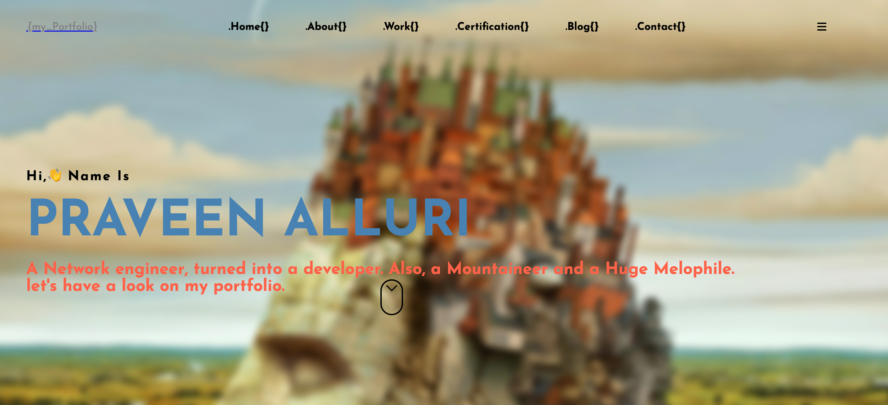

# Portfolio Design
<p> 
Hi :wave: Coders!
<br> This is my portfolio website design using HTML & CSS technologies.
</p>


<ul>

`HTML`

`CSS Flex Box`

`CSS Cards`


</ul> 


<p> go to your local projects and use below command.</p>

 ``` git clone https://github.com/praveenAlluri22751/portfolio ```


<ul>

`CSS cards`

`CSS Flex Box`

`CSS positions`


</ul> 


<p>
This is my Portfolio.
<br>It took me more than 30 hrs to align things in a suitable place.<br>Removing white lines and CSS flexbox, positions took much time. In the end, I figured it out… Big thanks to the Stackoverflow team.
</p>

Stay peace :lotus_position:



[Protfolio Link](https://yellowmultiverse.netlify.app/)

# Hangouts

[](https://www.linkedin.com/in/praveen-alluri-b31962117/)

[](https://twitter.com/Ugra1)

[](https://www.instagram.com/ipa22751/)

[](https://theyellowmultiverse.com/)
